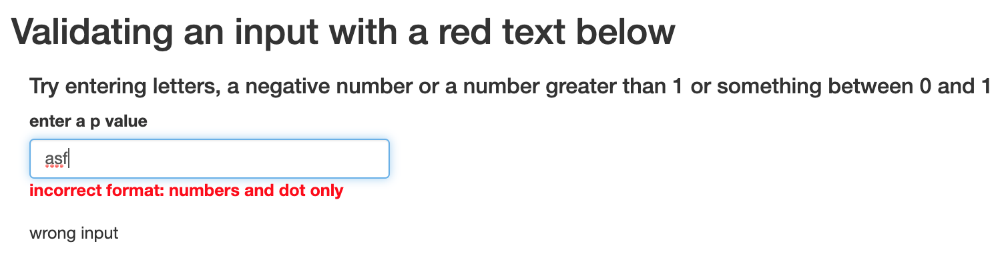

# validatetxtinpt
A small package to validate textInputs which are used instead of numericInputs right below the input itself. If the value either has incorrect format or does not satisfy a condition information in red is shown right below the input. Example below

 
 
 

```{r gh-installation, eval = FALSE}
# install.packages("devtools")
devtools::install_github("jaropis/validatetxtinpt")
```

```{r, eval = FALSE}
library(shiny)
library(dplyr)
library(validatetxtinpt)
ui <- fluidPage(
  validatetxtinpt::useValidateTextInput(),
  shinyjs::useShinyjs(),

  titlePanel("Validating an input with a red text below"),
  fluidPage(
    tags$h4("Try entering letters, a negative number or a number greater than 1 or something between 0 and 1"),
    textInput("text_input", "enter a p value", value = ""),
    textOutput('text_output')
  )
)

server <- function(input, output, session) {
  ns <- session$ns
  add_validation_to_input(ns("text_input"))
  output$text_output <- renderText({
    validate_input(input_id = ns("text_input"),
                   text_value = input$text_input,
                   condition = 'x >= 0 && x <= 1',
                   incorrect_format = "incorrect format: numbers and dot only",
                   incorrect_value = "incorrect value: p >= 0  and <= 1")
  })
}

shinyApp(ui = ui, server = server)
```
